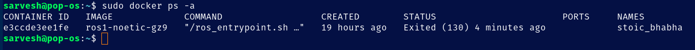

## DOCKER INSTALLATION GUIDE: 

Open a terminal and runn the following commands:
 
```bash
sudo apt update
sudo apt install docker.io
```

This actuall completes our docker installation. Next, let us check if we have successfully installed the docker

```bash
sudo systemctl enable docker    # Enables the Docker
sudo systemctl status docker    # Checls whether the docker is active
sudo docker run hello-world     # Runs a simple example
```

Now we need to write a docker file. It is as follows:
```Dockerfile
# Use official Noetic with Gazebo pre-installed
FROM osrf/ros:noetic-desktop-full

# Set up environment
ENV DEBIAN_FRONTEND=noninteractive

# Install basic tools
RUN apt-get update && apt-get install -y \
    git \
    sudo \
    python3-pip \
    python3-rosdep \
    build-essential \
    net-tools \
    curl \
    lsb-release \
    && rm -rf /var/lib/apt/lists/*

# Initialize rosdep (check first to avoid error)
RUN if [ ! -f "/etc/ros/rosdep/sources.list.d/20-default.list" ]; then \
      rosdep init && rosdep update; \
    else \
      echo "rosdep already initialized"; \
    fi

# Create and set up a catkin workspace
RUN mkdir -p /home/catkin_ws/src
WORKDIR /home/catkin_ws

# Source ROS by default in container sessions
RUN echo "source /opt/ros/noetic/setup.bash" >> ~/.bashrc

CMD ["bash"]
```


This is a docker file which will help us install ros-noetic with Gazebo 9 on our system.

Now in order to use this, we need to run the following commands:

```bash
# Run the command within the root of the workspace where you have written the Dockerfile
docker build -t ros1-noetic-gz9 .

# It takes around 10-20 mins for this to install all the packages, and once done, run the following command

# Now run the following command to use the docker container
sudo docker run -it --rm --name ros1_dev ros1-noetic-gz9
```


Now, we get our ros and gazebo installed. But in order to access it, we need to run the following commands in your terminal:
``` bash 
# Source the ros environment
source /opt/ros/noetic/setup.bash

# Now this makes ros accesible for us
roscore
```

Now in a new terminal, run:
``` bash
sudo docker ps
```

This actually lists the container id and its status. Now, usin the id ru the following command in the same terminal

```bash
sudo docker exec -it <container_id_or_name> bash
```

This actually makes the container accessible in the other terminal as well and now we can use docker over there as well.

Again, you need to source ros usin the ``` source /opt/ros/noetic/setup.bash ``` command. 

Now running the command ```rostopic list``` will enlist all the available topics of ros. This also indicates that ros is successfully installed.

This concludes the installation of ros in the docker. 

Now, since Gazebo is preinstalled, we need to give it access of the host's X server to the container. For this run the following commands in the host pc:

```bash
sudo apt update
sudo apt install x11-xserver-utils  # Installs the x11-xserver-utils on the host (if not installed)
sudo xhost +local:docker
```
This allows Docker container to connect to your host's display server, and thus the GUI apps(like turtlesim or Gazebo can pop up on the screen)

Now, we need to run  Gazebo in the Docker container. Gazebo needs OpenGL to render its GUI, and in a Docker container, OpenGL doesn’t always work out of the box. So we need to install the NVIDIA Container Toolkit (if not already installed).

```bash
# Run this on your host PC
sudo apt update
sudo apt install -y nvidia-container-toolkit
sudo systemctl restart docker
```

And now as the installation is done, the docker container can access the OPENGL and the GUI. Now you need to run the docker using the following command in order to access the GUI and OPENGL:

```bash
sudo docker run -it \
  --env="DISPLAY" \
  --volume="/tmp/.X11-unix:/tmp/.X11-unix:rw" \
  --gpus all \
  --privileged \
  <your-image-name>

  # The one we are using is :
  sudo docker run -it \
  --env="DISPLAY=$DISPLAY" \
  --env="QT_X11_NO_MITSHM=1" \
  --volume="/tmp/.X11-unix:/tmp/.X11-unix:rw" \
  --gpus all \
  --privileged \
  ros1-noetic-gz9

```

Replace ```<your-image-name>``` with the name of your docker image. In our case it is ``ros1-noetic-gz9``.

Now, when you run the command 
```bash
gazebo --verbose 
```

This pops up the Gazebo GUI on the screen. This completes our ros1-Gazebo setup in the Docker.

### REUSING THE CONTAINER

We cannot always be inside the same container. But Docker enables us to reuse the container which was previously in use. For doing this we need to know the name of the container we were operating.

```bash
sudo docker ps -a   # lists all the previous containers we were using
```

We should be geting data like:  



So next we need to give the access to the display and gpus to this container, and then run the container. So 

```bash
sudo xhost +local:docker
# This gives the access to the Docker container
sudo docker container start -i <container_name_we_wanna_run>

# In our case it is stoic_bhabha
sudo docker container start -i stoic_bhabha
```

This runs the same container, enabling us to access our previous progress.


### ADDING USER IN THE DOCKER

```bash
# Addin the user in the docker
adduser <username>    # in our case, " adduser dev_sarvesh "

# It will prompt to set a new password and other relevant info

# Giving sudo privileges to the user
usermod -aG sudo dev_sarvesh

# Switching to New User
su - dev_sarvesh

sudo apt update

```