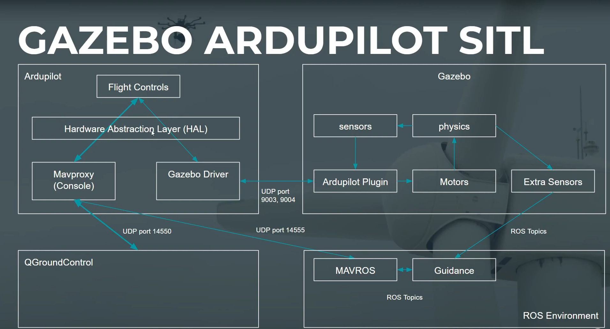
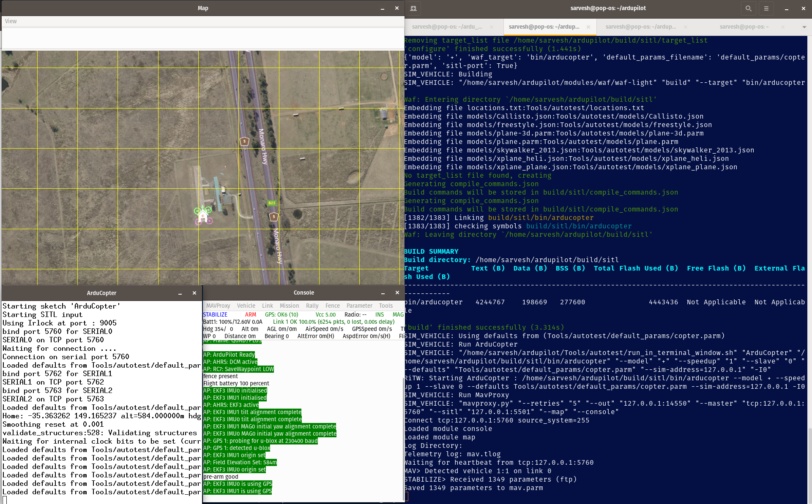

# SOFTWARE IN THE LOOP(SITL) USING ARDUPILOT

This is a simple architecture of how the SITL runs.



### GIVEN BELOW ARE THE STEPS FOR RUNNING THE SITL USING THE ARDUPILOT

Open a terminal and run the following commands:

First we need to clone the Ardupilot repository

```bash 
git clone --recursive https://github.com/ArduPilot/ardupilot.git
```

After cloning the repository, 

```bash
cd ~/ardupilot
Tools/environment_install/install-prereqs-ubuntu.sh -y
```
The buildup and install may take some time depending on the internet speed. Once done, run the following in the same terminal in the root of the Ardupilot:

```bash
. ~/.profile

./waf configure --board sitl

./waf copter
```

Now this completes our entire buildup of the Ardupilot-SITL. Now to run the SITL;

```bash
./Tools/autotest/sim_vehicle.py -v ArduCopter --console --map
```

Running this pops up 3 windows, one being the MAVConsole, other is the Map and other is the of SITL.



## RUNNING IN ROS1 USING DOCKER

After making the ros container and executing it;

```bash
# 1. Add the ROS source to apt
sudo sh -c 'echo "deb http://packages.ros.org/ros/ubuntu $(lsb_release -sc) main" > /etc/apt/sources.list.d/ros-latest.list'

# 2. Add the ROS key
sudo apt-key adv --keyserver 'hkp://keyserver.ubuntu.com:80' --recv-key C1CF6E31E6BADE8868B172B4F42ED6FBAB17C654

# 3. Update package index
sudo apt-get update

# 4. Install MAVROS and extras
sudo apt-get install ros-noetic-mavros ros-noetic-mavros-extras

```

## RUNNING SITL WITH ROS AND GAZEBO


After following the official documentation , use the following command in terminal 
```bash
mavproxy.py --console --map --aircraft test --master=:14550
```

This starts the Mavproxy and we can access the map as well as use the commands to control the drone. 

Now to start the MAVROS, run the following command in new terminal

```bash
ros2 run mavros mavros_node _fcu_url:="udp://:14551@127.0.0.1:14550"
```